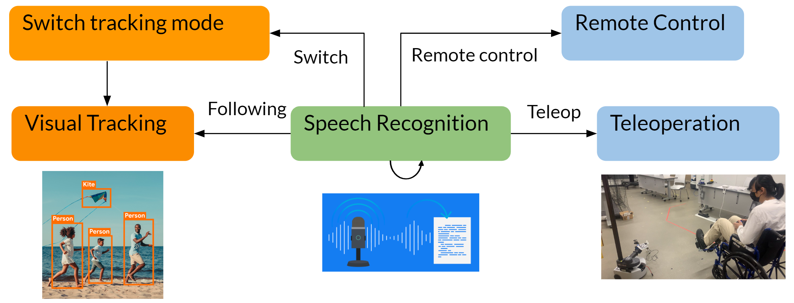

# WeHelp

Abulikemu Abuduweili, Alice Wu, Tianhao Wei, Weiye Zhao, [WeHelp: A Shared Autonomy System for Wheelchair Users](https://arxiv.org/abs/2409.12159), arXiv.  

## Introduction
In this project, we developed WeHelp, a shared autonomy system for wheelchair users. The system operates in three modes: following, remote control, and tele-operation. In following mode, the robot autonomously follows the wheelchair user using visual tracking and can follow from behind, the left, or the right. When the user requests assistance, the robot switches to tele-operation or remote control mode via speech recognition.
In tele-operation mode, the user controls the robot with a joystick to perform tasks such as opening doors, moving obstacles, or retrieving objects from high shelves or the floor. In remote control mode, a remote assistant takes control of the robot to help with complex tasks. Our evaluation shows the system is practical and beneficial for wheelchair users.

We implemented WeHelp on the Stretch Research Edition (RE1) robot by [Hello Robot](https://hello-robot.com/product), a mobile manipulator designed for home environments.

[Presentation Slides](https://zackory.com/rc2022/media/WeHelp.pdf)

  

## Demo

Following from behind (robot’s view).  
  
  
  
Following on left (robot’s view). 
  
  
  
Following from behind then switch to left mode. 
  
  
  
